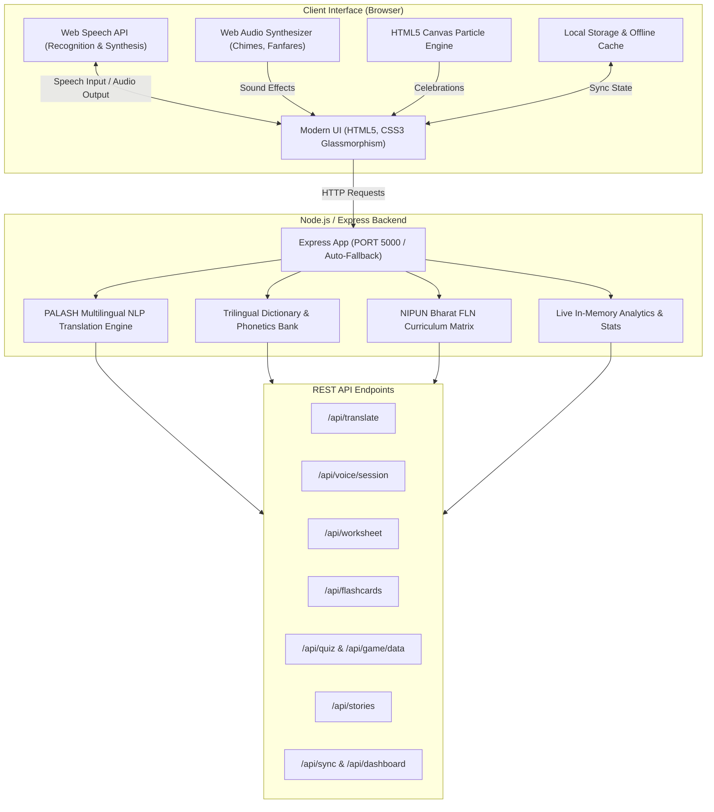

# 🌿 PALASH MTB-MLE AI Technology Bridge
### Jharkhand's Mother Tongue-Based Multilingual Education AI Platform for 5,000+ Primary Schools

[](https://nodejs.org/)
[](https://expressjs.com/)
[](https://developer.mozilla.org/en-US/docs/Web/API)
[](https://www.education.gov.in/)
[](https://github.com/)

---

## 📖 Overview

**PALASH MTB-MLE** is an intelligent, lightweight, and offline-first educational bridge designed for primary schools across Jharkhand, India. In line with the **National Education Policy (NEP 2020)** and the **NIPUN Bharat Mission** for Foundational Literacy and Numeracy (FLN), PALASH empowers rural educators to eliminate the language barrier between official school curricula (Hindi & English) and the indigenous mother tongues spoken by tribal children: **Santhali (ᱥᱟᱱᱛᱟᱲᱤ)**, **Ho**, and **Mundari**.

By providing real-time voice translation, bilingual classroom worksheets, 3D interactive flashcards, phonetic pronunciation guides, and gamified learning zones, PALASH ensures every child learns with joy and confidence in their home language.

---

## 🌟 Key Highlights & Core Capabilities

### 1. ⇄ AI Multilingual Translation Bridge
- **Bidirectional Translation**: English ↔ Hindi ↔ Santhali (Ol Chiki), Ho, and Mundari.
- **Native Script & Romanized Phonetics**: Renders native tribal scripts (such as Ol Chiki: `ᱡᱚᱦᱟᱨ`) alongside Romanized and Devanagari pronunciation guides (`जोहार (jo-HAR)`), enabling non-tribal teachers to speak accurately.
- **Classroom-Curated Vocabulary**: Pre-trained dictionary containing classroom commands, greetings, daily objects, numbers, colors, and nature terms.

### 2. 🎙️ Live Voice Classroom
- **Real-Time Speech-to-Speech & Speech-to-Text**: Powered by browser Web Speech APIs (`en-IN`, `en-US`, `hi-IN`).
- **Interactive Audio Waveform Equalizer**: Visual feedback during teacher speech input.
- **Classroom Quick Presets**: Instant voice prompts for Morning Assembly, FLN Lessons, and Storytelling sessions.
- **Low Latency**: Sub-100ms average response time for synchronous classroom interaction.

### 3. 📝 NIPUN Bharat Worksheet Generator
- **Bilingual & Trilingual Activity Sheets**: Generates printable FLN worksheets mapped to literacy and numeracy competencies.
- **Activity Types**: Includes "Identify & Speak" (🗣️) and "Trace & Match" (✍️) exercises.
- **Print & Export Ready**: Complete with institutional headers, learning outcomes, teacher remarks, grading stamps, and QR codes.

### 4. 🎴 3D Visual Flashcards
- **Interactive 3D Flip Effects**: Visual symbols, English and Hindi keywords, and native tribal terms with phonetics.
- **Domain Categories**: Classroom items, Numbers, Colors, Animals, and Forest Nature.
- **Audio Pronunciation**: Instant sound triggers for auditory reinforcement.

### 5. 🎮 भाषा खेल (Game Arena) & बाल वाटिका (Kids Zone)
- **Age-Tiered Gamification**: Tailored difficulty tiers for **Kids** (Ages 5–8), **Youth** (Ages 9–17), and **Adults** (18+).
- **Interactive Quizzes**: Visual hints, immediate feedback, and cultural context notes (e.g., Sarhul festival, Dalma wildlife sanctuary, Sohrai art).
- **Audio Synthesizer Engine**: Procedural sound generation (chimes, celebratory fanfares, tap tones) via the Web Audio API without external audio assets.
- **Confetti Physics**: Native HTML5 Canvas confetti particle celebration upon quiz completion.
- **Bilingual Illustrated Stories**: Dual-language synced readers (e.g., *"The Bird and Water"*, *"First Day of School"*).

### 6. 📶 Offline-First Resilience
- Built specifically for schools in remote geographies (Saranda forest, Kolhan, Santhal Pargana, Chota Nagpur plateau) with intermittent or zero internet connectivity.
- Local browser caching, state persistence, and instant offline database synchronization via `/api/sync`.

### 7. 📊 Teacher Dashboard & Performance Analytics
- Real-time tracker monitoring covered schools (5,000+ target), active languages, lessons conducted, worksheets generated, and daily translation counts.
- Teacher profile progression with FLN milestone badges and daily streaks.

---

## 🗣️ Supported Languages & Scripts

| Language | Native Script | Sample Greeting | Phonetic Guide | Status |
| :--- | :--- | :--- | :--- | :---: |
| **Santhali** | Ol Chiki (`ᱥᱟᱱᱛᱟᱲᱤ`) | ᱡᱚᱦᱟᱨ | *Johar (जोहार)* | Active |
| **Ho** | Devanagari / Varang Kshiti | जोहार | *Johar (जोहार)* | Active |
| **Mundari** | Devanagari / Bani Hisir | जोहार | *Johar (जोहार)* | Active |
| **Hindi** | Devanagari (`हिन्दी`) | नमस्ते / सुप्रभात | *Namaste / Suprabhat* | Core Bridge |
| **English** | Latin | Good Morning / Welcome | *Good Morning* | Gateway |

---

## 🏛️ System Architecture



---

## 📂 Project Structure

```text
palash-mtb-mle/
├── public/                     # Frontend Client Assets
│   ├── index.html              # Responsive Single-Page Application (SPA) layout
│   ├── script.js               # Client controller, Web Speech, Web Audio, Gamification logic
│   └── style.css               # Design system, themes, animations, print stylesheets
├── server.js                   # Express.js REST API & In-memory Multilingual NLP Engine
├── package.json                # Project dependencies and run scripts
├── package-lock.json           # Locked dependency tree
├── .vscode/                    # VS Code Workspace Launch & Tasks configuration
│   ├── launch.json             # Debug configurations for Node.js
│   ├── tasks.json              # Build and run tasks
│   └── settings.json           # Editor recommendations
└── README.md                   # Project documentation
```

---

## 🔌 API Reference

### 1. Health & Configuration
- **`GET /api/health`**
  - Returns backend health, operational status, supported languages, and uptime.
- **`GET /api/languages`**
  - Returns metadata for all supported languages (native scripts, greetings, vocabulary size).
- **`GET /api/phrases?language=:lang`**
  - Returns categorized classroom phrases with English, Hindi, tribal translations, and visual emojis.

### 2. Translation & Voice
- **`POST /api/translate`**
  - **Body**: `{ "text": "Good morning children", "sourceLanguage": "English", "targetLanguage": "santhali" }`
  - **Response**: Translated text in native script, phonetic transliteration, intermediate Hindi bridge, and latency metrics.
- **`POST /api/voice/session`**
  - **Body**: `{ "transcript": "Open your book", "targetLanguage": "ho" }`
  - **Response**: Translated voice payload and timing diagnostics.

### 3. Pedagogy & Learning Tools
- **`GET /api/curriculum`**
  - Returns NIPUN Bharat Foundational Literacy and Numeracy modules, learning outcomes, and core competencies.
- **`POST /api/worksheet`**
  - **Body**: `{ "topic": "Foundational Literacy", "grade": "Grade 1", "targetLanguage": "santhali", "count": 5 }`
  - **Response**: Fully compiled bilingual worksheet ready for digital display or paper print.
- **`POST /api/flashcards`**
  - **Body**: `{ "targetLanguage": "santhali", "topic": "Classroom", "count": 8 }`
  - **Response**: Structured card deck containing English, Hindi, tribal text, phonetics, and emoji visuals.

### 4. Interactive Gamification & Stories
- **`POST /api/quiz`**
  - **Body**: `{ "targetLanguage": "mundari", "topic": "Colours", "count": 5 }`
  - **Response**: Multiple-choice questions with answer options, hints, and feedback strings.
- **`POST /api/game/data`**
  - **Body**: `{ "age": 7, "tier": "kids", "topic": "Colours", "targetLanguage": "santhali" }`
  - **Response**: Multi-tier gamified challenge objects with cultural folklore notes and color hex values.
- **`GET /api/stories?targetLanguage=:lang`**
  - Returns bilingual illustrated story sets formatted for sequential sentence-by-sentence reading.

### 5. Analytics & Offline Sync
- **`GET /api/dashboard`**
  - Returns live operational KPIs: schools reached, active devices, worksheets generated, translations performed today.
- **`GET /api/sync`**
  - Sync metadata package and dictionary versioning for client-side offline storage.

---

## 🚀 Getting Started

### Prerequisites
- [Node.js](https://nodejs.org/) (v16.0.0 or higher recommended)
- Modern web browser (Google Chrome, Microsoft Edge, or Mozilla Firefox with Web Speech API enabled)

### Installation

1. **Clone or download the repository**:
   ```bash
   git clone https://github.com/your-org/palash-mtb-mle.git
   cd palash-mtb-mle
   ```

2. **Install dependencies**:
   ```bash
   npm install
   ```

3. **Run the application**:
   ```bash
   npm start
   ```
   *Or for development with automatic browser launch:*
   ```bash
   npm run open
   ```

4. **Access the application**:
   Open your browser and navigate to:
   ```text
   http://localhost:5000
   ```
   *(If port `5000` is currently in use, the server automatically finds and binds to the next free port, such as `5001` or `5002`.)*

---

## 🎯 Alignment with National Educational Goals

- **NEP 2020 Clause 4.11–4.14**: Emphasizes home language/mother tongue as the medium of instruction till at least Grade 5 to prevent dropouts and foster cognitive development.
- **NIPUN Bharat (National Initiative for Proficiency in Reading with Understanding and Numeracy)**: Targets universal foundational literacy and numeracy by Grade 3.
- **Inclusion of Eighth Schedule & Indigenous Languages**: Celebrates the rich heritage of Santhali while extending digital equity to Ho and Mundari speaking communities.

---

## 🤝 Contributing

Contributions from linguists, tribal education specialists, teachers, and developers are welcome:
1. Fork the repository.
2. Create your feature branch (`git checkout -b feature/AddKurukhSupport`).
3. Commit your changes (`git commit -m 'Add Kurukh language phrase bank'`).
4. Push to the branch (`git push origin feature/AddKurukhSupport`).
5. Open a Pull Request.

---

## 📄 License

This project is licensed under the **MIT License** — feel free to use, adapt, and deploy for educational institutions and community initiatives.

---

**Built with ❤️ for the teachers and tribal children of Jharkhand.** 🌿✨
